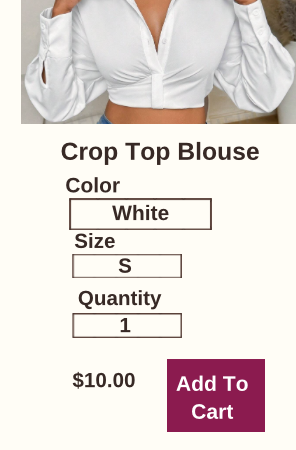

# Test Cases: Melly's Closet

## Functional Testing

### Test Case 1

- **Test Case ID**: TC-001
- **Test Case Title**: Verify that users can sign up
- **Objectives**: Ensure that users can successfully sign up with valid credentials
- **Pre-conditions**: The user does not have an existing account
- **Test Data**: 
  - First Name: "John"
  - Email: "johndoe@gmail.com"
  - Passwors: "Password123"
  - Confirm Password: "Password123"
- **Test Steps**:
  1. **Navigate to the Sign-Up page**: [Sign-Up Page](https://mjacobs1341.github.io/Mellys-Closet/signup.html)
     - **Expected Result**: 
       - The sign-up page should load successfully
       - There are input fields for: First Name, Email, Password and Confirm Password 
       
  2. **Enter the details in the sign-up form**:
     - First Name: "John"
     - Email: "johndoe@gmail.com"
     - Passwors: "Password123"
     - Confirm Password: "Password123"
      - **Expected Results**: The sign-up form accepts the inputs
  3. **Click the submit button**
      - **Expected Result**: 
         - The sign-up button is clickable and functional
         - Redirects to the homepage 
         
  4. **Verify redirection to the homepage**
     - **Expected Result**: User is redirected to the homepage and login form [Homepage](https://mjacobs1341.github.io/Mellys-Closet/index.html)
- **Status**: PASS

---

## GUI Testing

### Test Case 2

 
- **Test Case ID**: TC-002
- **Test Case Title**: Verify product images display correctly on "Shop the Look" page
- **Objectives**: Ensure that all product images on the "Shop the Look" page are displayed without distortion or layout issues
- **Pre-conditions**: User has access to the Shop the Look page
- **Test Data**: None
- **Test Steps**:
  1. **Navigate to the [Shop the Look page](https://mjacobs1341.github.io/Mellys-Closet/product.html)
     - **Expected Result**: 
       - The page should load successfully without errors
       - All three images are visible 
       
  2. **Inspect each product**:
     - **Expected Results**: 
       - Each product image should be displayed properly with a clear and correct layout
       - Each product should include: 
         - Image 
         - Product Name
         - Description
         - "Shop this look" button
        
  3. **Check the product images**
      - **Expected Result**: 
         - Ensure that the images for each product are equal size and not stretched or distorted
- **Status**: PASS
 

---

## Usability Testing

### Test Case 3

- **Test Case ID**: TC-003
- **Test Case Title**: Verify the "Add to Cart" button is user-friendly and provides visual feedback
- **Objectives**: Ensure that the "Add to Cart" button is easy to locate, interact with and provides feedback when clicked, making it clear to the user that their action was recognized
- **Pre-conditions**: User is on the brunch vibes page, and the "Add to cart" button is visible
- **Test Data**: Product available to add to cart
- **Test Steps**:
  1. **Navigate to the [Brunch Vibes Page](https://mjacobs1341.github.io/Mellys-Closet/brunch-vibes.html)
     - **Expected Result**: 
       - The page should load successfully without errors
  2. **Check that the "Add to Cart" button is clearly visible**:
      - **Expected Results**: 
         - The "Add to Cart" button should be label and easy to spot
        
  3. **Click the "Add to Cart" button**
      - **Expected Result**: 
         - The "Add to Cart" button should change color, indicating the button has been pressed
        
- **Status**: FAIL